# 📘 CDS Guide — A Personal SAP ABAP CDS Study Guide

Welcome to **CDS Guide**! This repository is a personal, growing collection of notes, syntax examples, and hands-on experiments built while learning **SAP ABAP Core Data Services (CDS)**. It is organized as a structured learning path so that both beginners and intermediate SAP developers can follow along, chapter by chapter, from the basics of `define view` all the way to annotations, OData exposure, and access control.

> 💡 This is a **learning journal turned study guide** — not official SAP documentation. Code examples favor clarity over completeness, and topics are expanded over time as understanding deepens. Corrections and improvements are welcome.

---

## 🎯 Purpose

- Consolidate scattered CDS notes into a single, browsable reference.
- Provide **working syntax examples** for the CDS concepts most commonly used in real S/4HANA / ABAP projects.
- Explain *what*, *why*, and *when* for each concept — not just syntax dumps.
- Capture practical tips, common mistakes, and interview-style notes gathered along the way.

## 👥 Target Audience

- **Beginner ABAP developers** starting their CDS journey.
- **Intermediate developers** who know classic ABAP (reports, tables, ALV) and want to move to the CDS-based data modeling approach.
- Developers preparing for **SAP interviews** or certification who want a quick, example-driven refresher.

---

## 🗺️ Learning Roadmap

```mermaid
graph LR
    A[01. Introduction] --> B[02. CDS Basics]
    B --> C[03. Data Modeling]
    C --> D[04. Annotations]
    D --> E[05. Filtering & Parameters]
    E --> F[06. Built-in Functions]
    F --> G[07. Query & Reporting]
    G --> H[08. OData & Consumption]
    H --> I[09. Security]
    I --> J[10. Examples]
```

Follow the chapters in numeric order if you are new to CDS. If you already know the basics, jump directly to the topic you need using the table below.

---

## 📂 Repository Structure

| Folder | Topic | Contents |
|---|---|---|
| [01-Introduction](01-Introduction/) | What CDS is, prerequisites | `README.md` |
| [02-CDS-Basics](02-CDS-Basics/) | Your first CDS view, using views in ABAP | `Main.md`, `Program.md` |
| [03-Data-Modeling](03-Data-Modeling/) | Associations, joins, unions, extensions | `Association.md`, `Join.md`, `Union.md`, `Extend.md` |
| [04-CDS-Annotations](04-CDS-Annotations/) | Global & local annotations, UI/OData metadata | `Annotation-Global.md`, `Annotation-Local.md`, `Annotation-LocalEx.md` |
| [05-Filtering-and-Parameters](05-Filtering-and-Parameters/) | Input parameters, conditions, session variables | `Parameters.md`, `Condition.md`, `Session.md` |
| [06-Built-In-Functions](06-Built-In-Functions/) | String, math, date, time, conversion & AMDP functions | `String.md`, `Math.md`, `Date.md`, `Time.md`, `Conversion.md`, `Function.md` |
| [07-Query-and-Reporting](07-Query-and-Reporting/) | Aggregations, filtering queries, ALV reporting | `Query.md`, `Report.md` |
| [08-OData-and-Consumption](08-OData-and-Consumption/) | Exposing CDS views as OData services | `OData.md` |
| [09-Security](09-Security/) | Access control (DCL), authorization checks | `AccessControl.md` |
| [10-Examples](10-Examples/) | End-to-end / supporting ABAP class examples | `Class.md` |
| [Appendix](Appendix/) | SAP GUI/ADT tips, transaction codes, quick reference | `Tips-and-Tcodes.md` |

---

## 📚 Topics Covered

- CDS view basics: `define view`, `define view entity`, SQL view names
- Associations, cardinality, path expressions
- Joins (inner, left/right outer, cross) and unions
- CDS view extensions (`extend view`)
- Input parameters and parameterized views
- Session variables (`$session`) and client handling
- Built-in SQL functions: string, math, date, time, conversion
- Currency and unit conversion
- Table functions and AMDP integration (overview)
- Global and local (element-level) annotations
- UI annotations (line item, facet, chart, data point, value help)
- Analytics annotations and analytical queries
- ObjectModel annotations (virtual elements, text associations, foreign keys)
- OData service exposure
- Access control / DCL and authorization checks
- Using CDS views in ABAP reports and ALV

---

## 🧭 CDS Learning Path

1. **Understand the fundamentals** — what a CDS view is and how it differs from a classic database view (01, 02).
2. **Model your data** — associations, joins, unions, and extensions (03).
3. **Enrich the view with metadata** — annotations that drive UI, OData, and analytics behavior (04).
4. **Make views dynamic** — parameters, filters, and session context (05).
5. **Apply business logic in SQL** — built-in functions for strings, numbers, dates, and unit/currency conversion (06).
6. **Query and consume the data** — aggregation, reporting, ALV (07).
7. **Expose the data externally** — OData services (08).
8. **Secure the data** — access control and authorization (09).
9. **See it all together** — worked examples (10).

## 🚀 How to Use This Repository

1. Clone or download the repository.
2. Open chapters in order, or use the structure table to jump to a topic.
3. Each `.md` file contains the original CDS/ABAP code samples in fenced code blocks — copy them into **ADT (ABAP Development Tools)** or the **SAP BTP ABAP Environment** to try them yourself.
4. Read the **Common Mistakes**, **Performance Considerations**, and **Interview Notes** sections at the end of each chapter — they capture the "why," not just the "how."

---

## 🛠️ Recommended SAP Versions

Availability is stated per **Application Server ABAP** release, since that is what the syntax actually depends on:

- **AS ABAP 7.40+** — classic CDS views (`define view`), the syntax used by most examples in this guide.
- **AS ABAP 7.55+** — CDS **view entities** (`define view entity`). As of 7.55, SAP recommends view entities over CDS DDIC-based views for new development.
- **SAP BTP ABAP Environment / ABAP Cloud** — for cloud-ready development against released APIs.

> ⚠️ `define view entity` does not exist before AS ABAP 7.55. On older systems, only the classic `define view` syntax is available. Examples in this guide use both, and the chapters state which is which.

## ✅ SAP Prerequisites

Before working through this guide, it helps to be familiar with:

- Basic **ABAP** syntax (`SELECT`, internal tables, classes)
- The **ABAP Dictionary** (tables, data elements, domains)
- Basic **SQL** concepts (joins, aggregation, filtering)
- ABAP Development Tools (**ADT**) in Eclipse, or the BTP-based ABAP environment

## ⌨️ Useful SAP Transaction Codes

| T-Code | Purpose |
|---|---|
| `SE11` | ABAP Dictionary — view generated SQL view names, tables |
| `SE80` / `SE24` | Object Navigator / Class Builder |
| `ST05` | SQL Trace — analyze CDS view performance |
| `SEGW` | Gateway Service Builder (classic OData) |
| `/IWFND/MAINT_SERVICE` | Activate/register OData services |
| `SU01` / `PFCG` | User & role maintenance (for testing access control) |
| `RSRT` | Test analytical queries |

See [Appendix/Tips-and-Tcodes.md](Appendix/Tips-and-Tcodes.md) for ADT navigation shortcuts and search tips.

---

## 🤝 Contribution

This is primarily a personal learning repository, but suggestions, corrections, and pull requests are welcome — especially:

- Fixing technical inaccuracies
- Adding missing built-in functions or annotations
- Improving explanations for beginners

Please keep additions consistent with the existing structure and style (short intro → syntax → examples → best practices).

## 📄 License

This project is licensed under the [MIT License](LICENSE) — feel free to use these notes for your own learning.

## 📬 Contact

- **Author:** Serhat Mercan
- **Email:** serhatmercan94@gmail.com

---

⭐ If this guide helped you learn SAP CDS, consider starring the repository!
